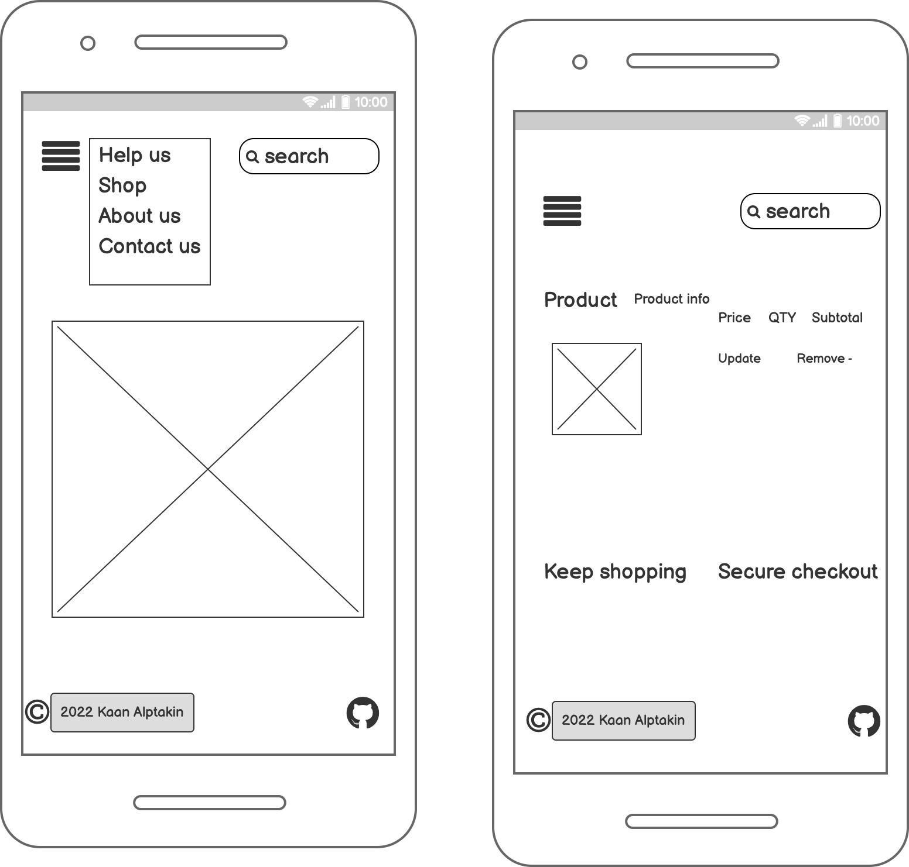

# The Tiny Paws

## Full stack Frameworks Project

#### The website presents Tiny Paws animal sanctuary and charity as an online platform. Users will be able to find shopping, to see information about the charity and animal centre, to see our animal frineds, also they could make an adoption or to shop with charity the will make a donation in an easy and simple way.

* To open live project click [here](https://kaan707-tiny-paws.herokuapp.com/) 
# Table of Contents

- [UX](#ux)
   - [User stories/User goals](#User-goals) 
   - [Structure of the website](#Structure-of-the-website)
   - [Wireframes](#Wireframes)
   - [Surface](#Surface)
       - [Colors](#Colors)
       - [Fonts](#Fonts)
       - [Images](#Images)
-  [Fetures](#Fetures)
-  [Technologies](#Technologies)
-  [Testing](#Testing)
   - [Functional testing](#Functional-testing)
   - [Compatibility testing](#compatibility-testing)
   - [Code Validation](#code-validation)
   - [User stories testing](#user-stories-testing)
   - [Issues found during site development](#issues-found-during-site-development)
   - [Performance testing](#performance-testing)
-  [Deployment](#deployment)
- [Credits](#Credits)
- [Screenhots](#Screenhots)

## User stories/User goals

### First-time user

| ID | As a/an | I want to be able to... | So that I can |
| ---| ---| --- | --- |
| 1 | Site User | Register to the site | Log in to my account |
| 2 | Site User | Log In and Log Out | View my profile |
| 3 | Site User | Receive email confirmation | Confirm successful registration |
| 4 | Site User | Have a user profile | View my purchases, and be able to check my order history |
| 5 | Potential customer | View a list of products | Select to purchase |
| 6 | Potential customer | View product details | See price and description |
| 7 | Potential customer | Contact with charity | Book a appointment for adoption proccess/ spend time with animal friends |
| 8 | Customer | View items in my bag | Check the cost to review |
| 9 | Customer | Enter payment information and see that process is secure | Smooth checkout |
| 10 | Administrator | Add new products and animal friends | To make them visible to customer |
|  11 | Administrator | Edit or update products | To change a price, description |
|  12 | Administrator | Remove products | To remove from site |

## Structure of the website

The Tiny Paws is designed to be simple and user-friendly on all types of devices. On desktop, tablet, or mobile device there should be no 
difference for a user to have a great experience. All parts are designed to concentrate maximum user satisfaction. Users will get some interaction from the interface as links and buttons will have a hover effect. User will be able to check products, details and animal friends.

## Wireframes

I used this website Balsamiq to create  wireframes.

# Surface

### Colors

Main colours used in a project:
* background color: #555; rgb (255,255,255), rgb (0,0,0)
* font color: #222; #212529 
* other colors: whitesmoke, rgb(217, 211, 211, 0.5)

### Fonts
* I used below fontts for my project:
    - Roboto,Oxygen-Sans
    - Ubuntu,Cantarell
    - Helvetica,sans-serif;
* The reason why I chose these fonts is that my page is more tidy and does not tire the eyes while looking at my page. 

### Images
* I used images from [Pixel.com](https://www.pexels.com/)) and there are credited in [credits](#credits) section.

[Back to Table of contents](#table-of-contents)

# Fetures

The website consists of 4 main pages. 13 are accessible from a navigation menu.

The website has below features:

## Navigation bar

* #### Navigation bar is visible at the top of each website. It is responsive and will adapt to mobile devices by a change into a burger menu.

* Navigation scheme:

 * On left side there is a logo. It can be used as navigation link to the main page.
 * On the middle search button
 * On right side two are two links or nav menu. It contains:
   * My account 
        - register
        - login
    * basket 
 * On the bottom there's a section contains below links:
    * Help us
        - Adoption
        - Donation
    * Shopping 
        - Activwear
        - New Arrivals
        - Jeans
        - Shirts
        - All Products
    * About us
        - About company
        - About pets
   * Contact us

## Home Page

* Users can see here charity slogan, shoop now button.

## Help us

* This section contains two different pages. One of them is the adoption page, which is giving information on how to adopt pets. The second one is the donation page gives info on how to donate to charity. 

## Shooping page

* In this section, users can see all shopping products, such as activewear, jeans, and shirts. Also, there is a filter so users can filter prices low to high or opposite, with an alphabetic letter, and others. 

## Checkout

* The secure checkout page allows users to add all necessary details to place an order. On the right-hand side of the screen, there is an order summary. A test purchase can be made with the following details:

 - credit card: 4242 4242 4242 4242
 - expiration date: 04 / 24
 - CVC: 424
 - ZIP: 42424

* The complete order will submit payment and redirect to the order confirmation page. Also, the user can go back to the bag to adjust the shopping bag.

## Checkout success - Thank you

* After purchase customer can see the order summary and two buttons:

 - Go back to the home page - user will be redirected to home page
 - Contact Us to book a space - user will be redirected to the contact us page.

## Log in

* If the user already signed in before, they can log in with a username and password. The username is more than five characters and the password is as well. If the user is the first time coming to our website, there's a link on the bottom "New here? Sign Up! 

## Sign up

* This section provides user sign-up information. If a user is a regular user of our webpage and they would like to see their previus orders. they need to sign up. 

## My profile

* If user is logged in then is able to view its profile. Options to update a profile or to browse order history are available.

## Contact us

* On this site a simple form allow the user to contact a fitness studio to book a space or make any other inquiry.

## Log out

* In this section users can log out anytime, when you log out the page will you direct to the all recipes page automatically.

[Back to Table of contents](#table-of-contents)

# Technologies

## Languages:

* HTML
* CSS
* javaScript
* JQuery
* Python
* Sqlite 3 

## Frameworks:

* JQuery: for easier and faster javascript and DOM manipulation.
* Bootstrap: used for creating a responsive design.
* Flask: used as Python web framwork.
* Werkzeug: used for password hasing and authentication.
* Font Awsome
* Google Fonts

## Other programs used:

* Balsamiq: for wireframing.
* Github
* Visual Studio Code: as a IDE (Integrated Development Environment) for developing the project
* Git: for version control
* Google Chrome Dev Tools: for testing purposes. Console logging checking for breakpoints.
* Prettier: to beautify code.
* Stripe: As a payment infrastructure
* Heroku: As a cloud-based hosting platform.
* Pillow
* AWS: As a storage service.

[Back to Table of contents](#table-of-contents)

# Testing 

## Functional testing

* I used the Google Chrome developer tools and Mozilla web developer tools to test and fix issues with responsiveness
and styling issues. In the style.css file, both tools made it extremely easy for me to use margin, padding, font, width, 
height and other elements correctly use on my web page.

## Compatibility testing

My website has been tested with multiple mobile devices and browsers. I've tested extension  devices in both Mozilla web 
developer tools and Chrome developer tools. 
 
Also, I tested on hardware devices such as iPhone5 iPhone 7S, iPhone 11, iPhone 12, and Samsung Galaxy S10 and 
Galaxy S21.

## Code validation

* [W3C HTML validator](https://validator.w3.org/) to validate HTML code
* [W3C CSS validator](https://jigsaw.w3.org/css-validator/) to validate CSS code
* [JavaScript validator ](https://jshint.com/) to validate JavaScript code
* [JShint](https://jshint.com/) to validate JavaScript code
* [Python Syntax Checker](https://extendsclass.com/python-tester.html) to verify syntax used.

[Back to Table of contents](#table-of-contents)

# Deployment

## To run the app on Heroku.

- Using the Heroku Command Line Interface
- Connect to a github repository. (The easier method)

1. ## Set up a new Heroku App:

Navigate to Heroku.com, create a new account or login if you already have an account.   
* On the dashboard page, click "Create New App" button.   
* Give the app a name, the name must be unique with hypens between words. 
* Set the region closest to you, and click "Create App".  

• Then, head over to the ‘settings’ tab and click on the ‘reveal config vars’ button. Configure the following:

    SECRET_KEY
    DATABASE_URL*
    EMAIL_HOST_PASSWORD
    EMAIL_HOST_USER
    STRIPE_PUBLIC_KEY
    STRIPE_SECRET_KEY
    STRIPE_WH_SECRET
* Stripe keys can be found in your stripe account, which you will need to set up at [Stripe](https://stripe.com/gb)

* EMAIL_HOST_PASSWORD

* Can be found in the security settings of your email host.

* The EMAIL_HOST_USER is simply the email address from which you want your emails to be sent from.

* DATABASE_URL can refer to whichever database system you have set up for your project. For this project, I used Postgres as it is the relational database I wanted and Heroku has a convenient package for it. Before you select the Postgres, you will need to install a couple of things on Github. You will need dj_database_url and psycopg2. Run the following commands to get them:

    pip3 install dj_database_url
    pip3 install psycopg2-binary
* At this point, you will need re-record all of your requirements by using the following command.

    pip3 freeze --local > requirements.txt
* Please note that you need to re-run the requirements command if you add any dependencies mid-project. Otherwise, Heroku will not deploy the app correctly.

* Finally, you can retrieve the URL for your Postgres in the the config vars part of the Heroku settings. Go to your main app settings.py and

    import dj_database_url
* Then find the database settings and remove the default settings. Instead, run the default as:

    ‘default’: dj_database_url.parse(‘URL from Postgres – found in Heroku config var’)
Now that you have a connection with the database, you will need to re-migrate all of your models. Run the following code:

    python3 manage.py migrate --plan
That will create all your databases. You will now need to “fill” the databases with products. You can do this by running the next command for every fixture in the project.

    python3 manage.py loaddata <fixturename.json>
With those set up, you can now push your project to Heroku directly from your IDE. First, you will need a ‘procfile’ which will tell Heroku what kind of application it is and how it should be run. The command for ‘procfile’ is:

    echo web: python run.py > Procfile
Log in to Heroku from the command line using:

    $ heroku login -i
Enter your username and password. Push your commits to Heroku using this command:

    $ git push -u Heroku master

# To run the app locally

To run this project locally, please ensure you have an IDE installed on your computer. Popular ones are gitpod, Visual Studio or PyCharm (for python projects specifically). Regardless of which IDE you choose, you will also need the following installed.

 1. PIP – to install packages such as django
 2. Python3 – the project uses Python3 for the backend language – specially Python 3.8
 3. Git – for easy version control

The next step is to access your github repository. Option 1 is to download a zip file.

 1. On the GitHub project page, there is a ‘code’ tab which will dropdown to allow you to download a zip file.
 2. Once downloaded, extract the files to a desired folder on the desktop.
 * Option 2 is to clone the repository.

    1. Under the same code tab, click to copy the url for your repository.
    2. Open Git Bash on your local computer or open the command line on your IDE and ensure you are in the right directory. Then run the following command:
    git clone https://github.com/cgpalmer/ms4.git
You can then select a file destination for the directory. First check you have pip installed on the machine:

    py -3 -m pip --version
It is recommended to use a virtual environment for the Python interpreter. Python's own built in environment can utilised by this code:

    python -m .venv <path for venv>

Please note: Different IDE and operating systems, your python command may be slightly different. You may also use the graphical interface to search and select an interpreter.

Once you have your virtual environment, you can activate it with:

    .venv\Scripts\activate

I have attached a link to the documentation on setting up a virtual environment, in case the commands are different: Python interpreter. Next, you will need to download all of your requirements for the project. You can do this manually or you can run this code:

     pip -r requirements.txt

Next you need to set up your environment variables in an env.py file. You will need the following for your code to run:

    SECRET_KEY
    DATABASE_URL*
    EMAIL_HOST_PASSWORD
    EMAIL_HOST_USER
    STRIPE_PUBLIC_KEY
    STRIPE_SECRET_KEY
    STRIPE_WH_SECRET

The database URL is so you can run the postgres server than I am running. If you remove the DATABASE_URL from the env, the settings.py will default to a sqlite3 database. Regardless of which database you run, will need to create the databases using the following commands. Stripe keys can be found in your stripe account, which you will need to set up at Stripe.

EMAIL_HOST_PASSWORD

Can be found in the security settings of your email host.

The EMAIL_HOST_USER is simply the email address from which you want your emails to be sent from.

Before you can start the local server, you will need to make sure your models have been created in the database. Follow these commands:

    python3 manage.py makemigrations --dry-run
This is to see the migrations before they occur.

    python3 manage.py makemigrations 
Make the migrations.

    python3 manage.py migrate --plan
This is to see the migrate before it occurs

    python3 manage.py migrate
Migrate the databases.

This will create a database of all of your models. You will then need to run the following code for each fixture in the project, in order to “fill” the databases.

    python3 manage.py loaddata <fixturename.json>
Once the data is loaded you can then run your server locally.

    python3 manage.py runserver 
This will open a port (which may be different depending on your IDE) and gives you the open to see your app.

## Acknowledgements

* I'd also like to give credit to Asos and Code Institute lessons - as their mobile designs gave me plenty of ideas and helped me to work through some of the more difficult navigation decisions.